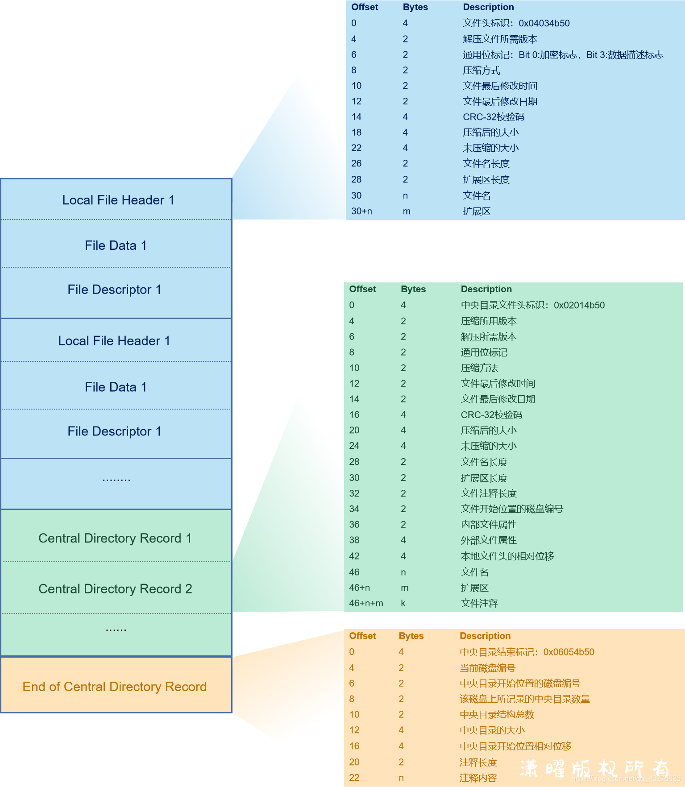

# ZIP

[参考链接](https://blog.csdn.net/qq_43278826/article/details/118436116?ops_request_misc=%257B%2522request%255Fid%2522%253A%2522166183431616781667848767%2522%252C%2522scm%2522%253A%252220140713.130102334..%2522%257D&request_id=166183431616781667848767&biz_id=0&utm_medium=distribute.pc_search_result.none-task-blog-2~all~baidu_landing_v2~default-4-118436116-null-null.142%5Ev42%5Epc_ran_alice,185%5Ev2%5Econtrol&utm_term=zip%E6%96%87%E4%BB%B6%E6%A0%BC%E5%BC%8F&spm=1018.2226.3001.4187)

1. 文件头 (04 03 4B 50)
2. 中央目录文件头 (02 01 4B 50)
3. 中央目录结束标记 (06 05 4B 50)

